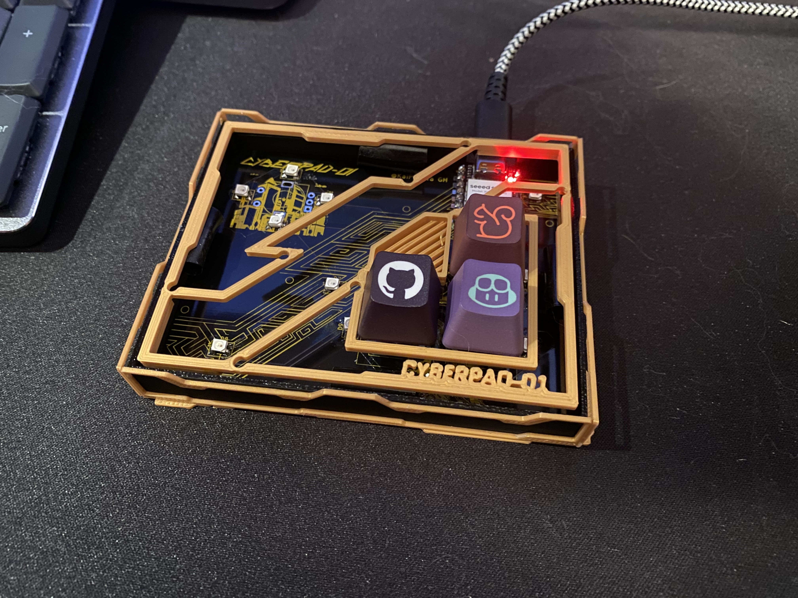

# CYBERPAD-01

The CYBERPAD-01 is a cyberpunk inspired macropad with 3 keys, a rotary encoder, and a whole lotta silkscreen and neopixels. It uses KMK firmware and was meant to serve as a learning opportunity for PCB's, CAD and rendering. 
## Custom Features
- Custom lasercut acrylic top panel
- EC11 Rotary Encoder for anything really
- 3 Keys to program to your heart's content
- 14 SK6812 MINI-E LEDs for backlight and and diffusion
- Cyberpunk inspired case for maximum aesthetic
-  Exposed PCB design with custom silkscreen cuz it's sick
## CAD Design

I used Onshape to design all of my parts. The laser cut acrylic panel is held together using minimalist bolts and spacers attached to the top plate. The actual case is designed so that everything can fit together seamlessly without using any screws or bolts for minimalism and aesthetics while still being secure.

It comprises of 4 separate 3D printed parts though, the bottom plate/aesthetic walls, the walls, and the top plate, the rotary encoder knob, with the 5th part being the laser cut acrylic top panel, so it's a bit difficult to print, but manageable. [Onshape Link](https://cad.onshape.com/documents/183c405de5c750134bf8a1de/w/282fa5c96ffeba0ae16f58ec/e/f98acd70bf74a51e29d61d0d?renderMode=0&uiState=6869deede1723828ff557213)
## PCB Design

The PCB was designed using KiCad and then I used Figma and the KiCad image converter for creating the silkscreen layers. I actually imported the case design into KiCad so I could use it as reference for the silkscreen which turned out really well.

## Firmware

The CYBERPAD-01 uses KMK firmware (written in Python) and was relatively straightforward.
- The rotary encoder changes volume
- The keys just act as VIM macro's
- Neopixels to backlight and diffuse any color you want

I'll probably make it a bit more complicated in the future, but I think it's kind of handy to have a macropad for some really complicated VIM stuff.

## Build Process

The build was decently simple, I soldered all the switches, neopixels and the XIAO onto the board using my pinecil. The neopixels were a pain because they were SMD but used a reverse mount footprint. I also didn't get my rotary encoder in time and not all my 3D printed parts came, but it looks really cool still:

Here's a simple demo too: https://youtu.be/StyHCeADP-Q

## Bill of Materials (BOM)

Here's everything you'll need to build the CYBERPAD-01:
- 3x Cherry MX Switches
- 3x Keycaps of your choice (I would personally suggest black ones)
- 14x SK6812 MINI-E LEDs
- 1x EC11 Rotary Encoder
- 1x Seeed XIAO RP2040
- 8x M2 Nut and Bolt, 1.5cm, Low profile top
- 8x M2 Spacers, 3mm diameter, 0.6cm, circular, non-threaded
- 1 Case (3 printed parts)
- 1 Custom Laser Cut Acrylic Panel

## Credits and Help

Thanks to @qcoral and @acornitum for starting highway and reviewing projects. @M0HID and @jamdotjar for helping me with Blender and @cheyao for the firmware starter code and helping me make my first macropad!

Also, thanks so much to PCBWay for sponsoring the yellow silkscreen PCB's, they look absolutely amazing and I'd highly suggest checking them out if you need really cool looking PCB's!
